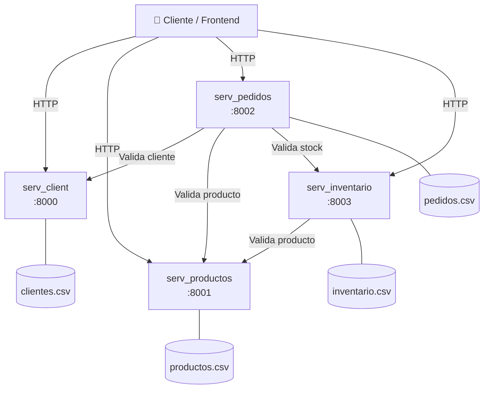
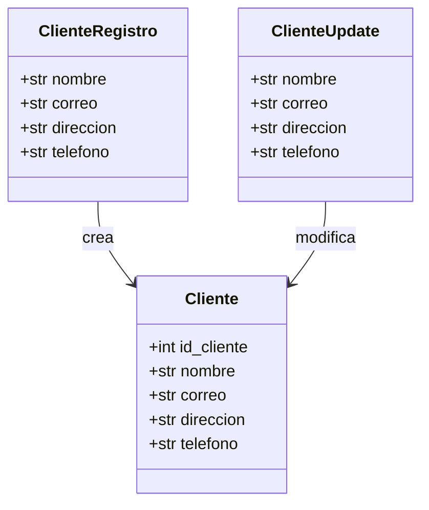
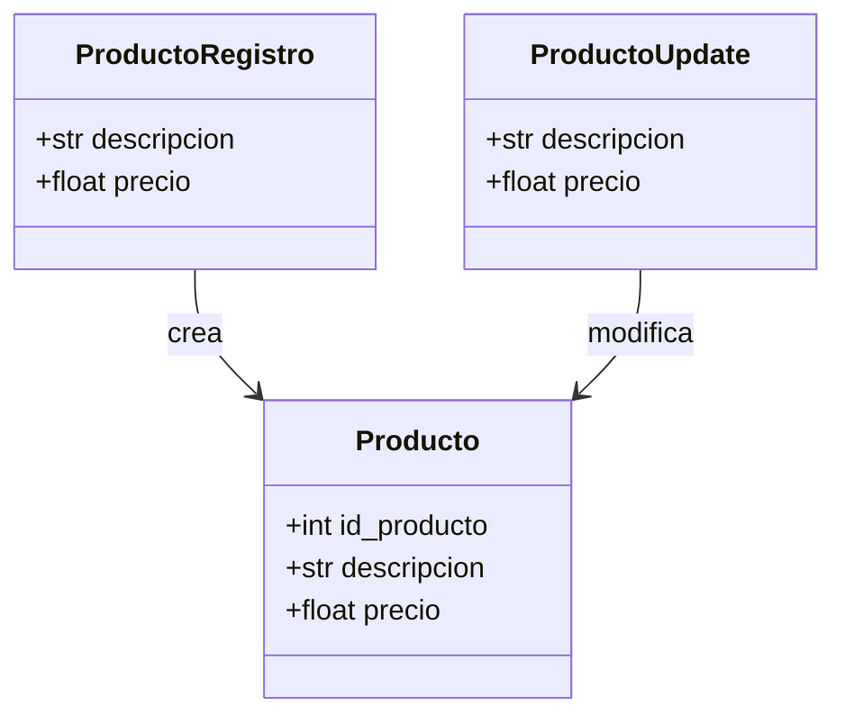
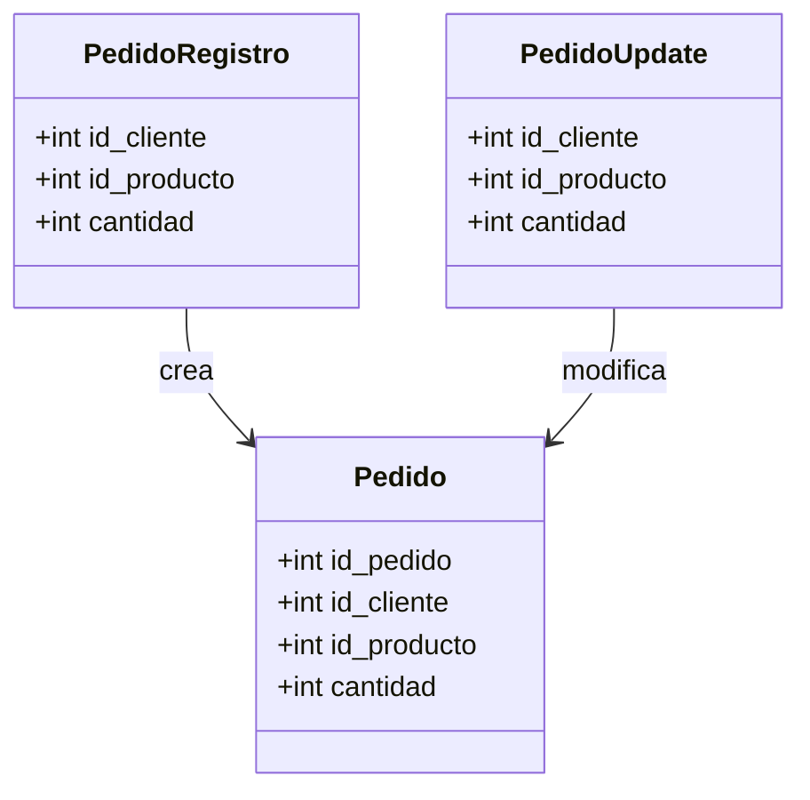
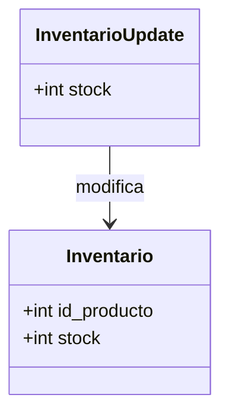
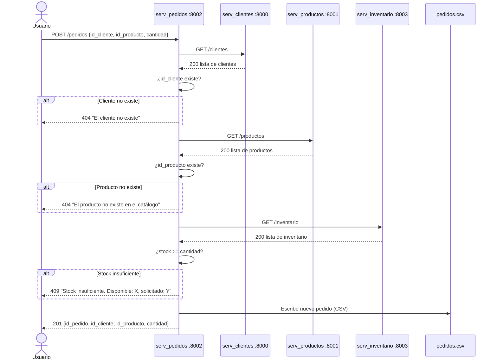

# 🛒 ShopNow — Sistema de Microservicios

Sistema de gestión de una tienda en línea construido con una arquitectura de **microservicios** en Python usando **FastAPI**. Cada servicio es independiente, expone su propia API REST y se comunica con los demás mediante llamadas HTTP.

> **Tecnológico Nacional de México — Campus Querétaro**  
> Materia: Desarrollo de Software  
> Autor: Diego Arias

---

## 📋 Tabla de contenido

- [Descripción general](#descripción-general)
- [Arquitectura](#arquitectura)
- [Servicios](#servicios)
- [Diagramas de clases](#diagramas-de-clases)
- [Diagrama de secuencia — Registrar pedido](#diagrama-de-secuencia--registrar-pedido)
- [Estructura de archivos](#estructura-de-archivos)
- [Validaciones implementadas](#validaciones-implementadas)
- [Instalación local](#instalación-local)
- [Despliegue en la nube](#despliegue-en-la-nube)
- [Endpoints disponibles](#endpoints-disponibles)

---

## Descripción general

ShopNow simula el backend de una tienda en línea dividido en cuatro departamentos autónomos. Cada microservicio:

- Corre en su propio puerto.
- Tiene su propia base de datos persistida en CSV.
- Valida sus datos de entrada con **Pydantic v2**.
- Se comunica con otros servicios vía **httpx** cuando necesita validar información cruzada.

---

## Arquitectura



---

## Servicios

| Servicio | Archivo | Puerto | Responsabilidad |
|---|---|---|---|
| Clientes | `serv_client.py` | `8000` | CRUD de clientes, validación de correo único |
| Productos | `serv_productos.py` | `8001` | CRUD del catálogo de productos, validación de descripción única |
| Pedidos | `serv_pedidos.py` | `8002` | Registro de pedidos con validación cruzada de cliente, producto y stock |
| Inventario | `serv_inventario.py` | `8003` | Control de stock por producto, valida existencia en catálogo |

---

## Diagramas de clases

### `serv_client.py`



### `serv_productos.py`



### `serv_pedidos.py`



### `serv_inventario.py`



---

## Diagrama de secuencia — Registrar pedido

El flujo más complejo del sistema: al registrar un pedido, `serv_pedidos` coordina validaciones con tres servicios antes de persistir el dato.



---

## Estructura de archivos

```
ShopNow/
├── serv_client.py          # Microservicio de Clientes     (puerto 8000)
├── serv_productos.py       # Microservicio de Productos    (puerto 8001)
├── serv_pedidos.py         # Microservicio de Pedidos      (puerto 8002)
├── serv_inventario.py      # Microservicio de Inventario   (puerto 8003)
├── serv_main.py            # Punto de entrada / orquestador
├── requirements.txt        # Dependencias Python
├── docker-compose.yml      # Configuración para correr con Docker
├── start.sh                # Script para levantar todos los servicios localmente
├── .gitignore
├── README.md
└── dbs/                    # Bases de datos persistentes (CSV)
    ├── clientes.csv
    ├── productos.csv
    ├── pedidos.csv
    └── inventario.csv
```

> **Nota:** la carpeta `dbs/` está en `.gitignore` — cada instancia genera sus propios archivos CSV al arrancar por primera vez.

---

## Validaciones implementadas

### `serv_client.py`
| Endpoint | Validación |
|---|---|
| `POST /clientes` | Correo único (case-insensitive), retorna `409` si ya existe |
| `PATCH /clientes/{id}` | El nuevo correo no puede pertenecer a otro cliente |

### `serv_productos.py`
| Endpoint | Validación |
|---|---|
| `POST /productos` | Descripción única (case-insensitive), retorna `409` si ya existe |
| `PATCH /productos/{id}` | La nueva descripción no puede coincidir con otro producto |

### `serv_pedidos.py`
| Endpoint | Validación |
|---|---|
| `POST /pedidos` | Verifica existencia del cliente en `:8000` → `404` si no existe |
| `POST /pedidos` | Verifica existencia del producto en `:8001` → `404` si no existe |
| `POST /pedidos` | Verifica stock suficiente en `:8003` → `409` si es insuficiente |
| `PATCH /pedidos/{id}` | Revalida solo los campos que cambian |
| Cualquiera | `503` si algún servicio dependiente no responde |

### `serv_inventario.py`
| Endpoint | Validación |
|---|---|
| `POST /inventario` | Verifica que el `id_producto` exista en el catálogo (`:8001`) → `404` si no |
| `PATCH /inventario/{id}` | Stock no puede ser negativo → `400` |

---

## Instalación local

### Requisitos

- Python 3.11+
- pip

### Pasos

```bash
# 1. Clonar el repositorio
git clone https://github.com/dans470/ShopNow.git
cd ShopNow

# 2. Crear entorno virtual e instalar dependencias
python -m venv venv
source venv/bin/activate        # Linux/macOS
# venv\Scripts\activate         # Windows

pip install -r requirements.txt

# 3. Crear carpeta de bases de datos
mkdir -p dbs

# 4. Levantar cada servicio en una terminal distinta
uvicorn serv_client:app     --reload --port 8000
uvicorn serv_productos:app  --reload --port 8001
uvicorn serv_pedidos:app    --reload --port 8002
uvicorn serv_inventario:app --reload --port 8003
```

O usar el script incluido:

```bash
bash start.sh
```

### Documentación interactiva (Swagger)

Una vez levantados los servicios, accede a la documentación en:

| Servicio | URL |
|---|---|
| Clientes | http://localhost:8000/docs |
| Productos | http://localhost:8001/docs |
| Pedidos | http://localhost:8002/docs |
| Inventario | http://localhost:8003/docs |

---

## Despliegue en la nube

El proyecto puede desplegarse en cualquier plataforma que soporte Python (Railway, Fly.io, Render, etc.). Cada microservicio se despliega como un servicio web independiente con su propio proceso.

Las URLs entre servicios se pasan como variables de entorno para que funcionen en cualquier entorno:

| Variable | Usado en | Apunta a |
|---|---|---|
| `CLIENTES_URL` | `serv_pedidos` | URL pública de serv-clientes |
| `PRODUCTOS_URL` | `serv_pedidos`, `serv_inventario` | URL pública de serv-productos |
| `INVENTARIO_URL` | `serv_pedidos` | URL pública de serv-inventario |

Si no se definen, los servicios usan `localhost` por defecto (entorno de desarrollo local).

---

## Endpoints disponibles

### Clientes `:8000`
| Método | Ruta | Descripción |
|---|---|---|
| `GET` | `/clientes` | Lista todos los clientes |
| `POST` | `/clientes` | Registra un nuevo cliente |
| `PATCH` | `/clientes/{id}` | Actualiza datos de un cliente |
| `DELETE` | `/clientes/{id}` | Elimina un cliente |

### Productos `:8001`
| Método | Ruta | Descripción |
|---|---|---|
| `GET` | `/productos` | Lista el catálogo completo |
| `POST` | `/productos` | Registra un nuevo producto |
| `PATCH` | `/productos/{id}` | Actualiza un producto |
| `DELETE` | `/productos/{id}` | Elimina un producto |

### Pedidos `:8002`
| Método | Ruta | Descripción |
|---|---|---|
| `GET` | `/pedidos` | Lista todos los pedidos |
| `POST` | `/pedidos` | Registra un pedido (con validación cruzada) |
| `PATCH` | `/pedidos/{id}` | Actualiza un pedido |
| `DELETE` | `/pedidos/{id}` | Cancela un pedido |

### Inventario `:8003`
| Método | Ruta | Descripción |
|---|---|---|
| `GET` | `/inventario` | Lista el inventario completo |
| `POST` | `/inventario` | Registra o actualiza stock de un producto |
| `PATCH` | `/inventario/{id}` | Actualiza el stock de un producto |
| `DELETE` | `/inventario/{id}` | Elimina un producto del inventario |

---

## Stack tecnológico

| Tecnología | Uso |
|---|---|
| [FastAPI](https://fastapi.tiangolo.com/) | Framework web para las APIs REST |
| [Pydantic v2](https://docs.pydantic.dev/) | Validación de modelos de datos |
| [Uvicorn](https://www.uvicorn.org/) | Servidor ASGI |
| [httpx](https://www.python-httpx.org/) | Cliente HTTP para comunicación entre servicios |
| CSV | Persistencia de datos ligera |